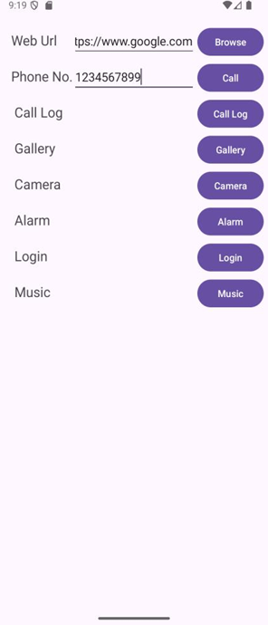

# Practical 3 – Android Implicit & Explicit Intents

This Android application demonstrates the use of **Explicit Intents**, **Implicit Intents**, **Login & Registration navigation**.  
Users can browse URLs, dial numbers, open call logs, use the camera, open the gallery, view alarms, and navigate between activities.

---

## Features

-  Explicit Intents (switching between Activities)
-  Implicit Intents (Browser, Call, Camera, Gallery, Alarm, Call Log)
-  Login Activity
-  Registration Activity
-  Material UI components
-  Optimized Kotlin code and ConstraintLayout UI

---

## Screenshots



---
## Project Structure
```
app/
├── java/com/example/practical3/
│ ├── MainActivity.kt
│ ├── LoginActivity.kt
│ ├── RegistrationActivity.kt
│ ├── MediaPlayer.kt
│ └── MediaPlayerService.kt
│
└── res/layout/
├── activity_main.xml
├── activity_login.xml
├── activity_registration.xml
└── activity_media_player.xml
```

---

# Implicit & Explicit Intents

## What are Intents?
In Android, an **Intent** is a message used to request an action from another component.  
This project demonstrates:

- **Explicit Intents** – open specific activities in the app  
- **Implicit Intents** – request system apps to perform actions

---

# Explicit Intents (Inside App Navigation)

### Login → Registration  
```kotlin
Intent(this, RegistrationActivity::class.java).also {
    startActivity(it)
}
```

---
# Implicit Intents (System-Handled Actions)

### Open URL in Browser
```kotlin
val show = Intent(Intent.ACTION_VIEW, msg.toUri())
startActivity(show)
```

### Make a Phone Call
```kotlin
val phoneNumber = "tel:1234567890"
val intent = Intent(Intent.ACTION_DIAL, Uri.parse(phoneNumber))
startActivity(intent)
```

### Open Camera
```kotlin
val intent = Intent(MediaStore.ACTION_IMAGE_CAPTURE)
startActivity(intent)
```
---


## Prerequisites

- Android Studio (Arctic Fox or later)
- Minimum SDK: API 21 (Android 5.0 Lollipop)
- Target SDK: API 34 (Android 14)
- Kotlin 1.9+

---

## Permissions Required

Add these permissions to your `AndroidManifest.xml`:
```xml
<uses-permission android:name="android.permission.CAMERA" />
<uses-permission android:name="android.permission.READ_MEDIA_IMAGES" />
<uses-permission android:name="android.permission.READ_CALL_LOG" />
<uses-permission android:name="android.permission.CALL_PHONE" />
<uses-permission android:name="android.permission.SET_ALARM" />
```

---

## Installation

1. Clone the repository:

2. Open the project in Android Studio

3. Sync Gradle files

4. Run the app on an emulator or physical device

---

## Key Learning Outcomes

- Understanding the difference between Explicit and Implicit Intents
- Activity navigation and data passing
- Interacting with system apps through intents
- Handling runtime permissions
- Implementing Material Design UI components

---

## Dependencies
```gradle
dependencies {
    implementation "androidx.core:core-ktx:1.12.0"
    implementation "androidx.appcompat:appcompat:1.6.1"
    implementation "com.google.android.material:material:1.11.0"
    implementation "androidx.constraintlayout:constraintlayout:2.1.4"
}
```
---
## Author

**Aashish Sah**  
- GitHub: [@aashishsah005](https://github.com/aashishsah005)
- Email: aashishsah005@gmail.com

---

## Acknowledgments

- Android Documentation for Intent APIs
- Material Design Guidelines
- Stack Overflow Community

---

## Support

If you found this project helpful, please give it a ⭐ on GitHub!


